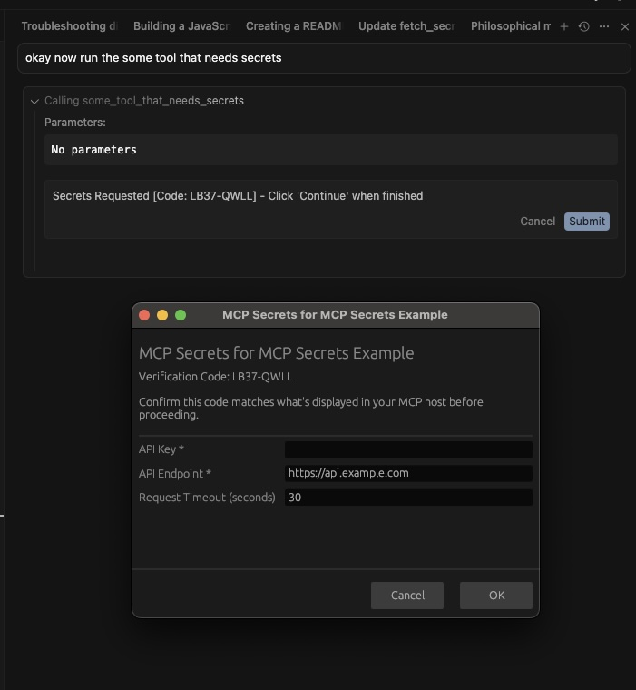

# 🔒 MCP Secrets 🔓

*When MCP servers need credentials and you want a decent(ish?) option.*

<p align="center">
  
</p>


## The Problem

MCP servers need API keys, passwords, and tokens. The obvious approaches are all terrible:

- **Environment variables**: Pollute your shell, leak in process lists
- **Config files**: Plain text secrets scattered everywhere 
- **Terminal input**: Visible in history, shoulder surfing paradise
- **Tell your LLM**: Because sending credentials to Anthropic/OpenAI/Alibaba/Whoever is brilliant
- **IDE temp cache**: Ephemeral and insecure
- **Hardcode them**: The nuclear option

MCP's elicitation feature sounds promising - direct input bypassing conversation logs. But the spec explicitly [warns](https://modelcontextprotocol.io/specification/2025-06-18/client/elicitation#security-considerations) against sensitive data because:

1. People screw up secrets management... like a lot
2. Opens doors to phishing attacks
   
    ...and evidenced by how many people set tool use to auto, that's not gonna get better
4. MCP utilities/IDEs might not be trustworthy
   
    ...actually they definitely are not - between the megacorps and the vibe coding projects bound to get hacked into oblivion, nope!


---
With all of this, what option are you left with if you want to give a bunch of neat tools to your models???

> How about using your system keychain like a sensible human?
---
<br/>


## The Solution

This framework stores secrets in platform-native secure storage (macOS Keychain, Windows Credential Manager, Linux libsecret) and presents an out-of-band native dialog when new credentials are needed.

### Key Features

- 🔐 **System keychain integration** - Actually secure storage
- 🖥️ **Native cross-platform dialogs** - No web UI nonsense  
- 🛡️ **Verification codes** - Anti-phishing protection...ish
- 🔒 **Secure by default** - Every secret access requires user permission
- 📋 **Session caching** - "Allow for session" reduces prompt fatigue
- ⚡ **Async operation** - Doesn't block MCP flow
- 🔄 **Python + JavaScript** - Because ecosystems exist and generating the javascript one took like 2 minutes.
- 🎯 **FastMCP integration** - Works with modern MCP frameworks and should be compliant going forward.

## How It Works

1. **Missing secrets detected** → Framework checks system keychain
2. **Dialog spawned** → Native OS dialog appears with form fields  
3. **MCP elicitation triggered** → Keeps connection alive, shows verification code
4. **User fills dialog** → Matches verification code, submits credentials
5. **Secrets stored** → Committed to system keychain
6. **Done** → Never ask again (until cleared)

The verification code prevents random dialogs from phishing your credentials. Cross-reference the code between the MCP client and the dialog box.

## Architecture

### Core Components

```
MCPSecretsManager     → Main interface, manages server-scoped secrets
MCPSecretsStorage     → Platform keychain abstraction  
AsyncUIHandler        → Cross-platform dialog spawning
fetch_secrets()       → Orchestrates elicitation + dialog flow
secrets_dialog        → Rust native dialogs (macOS/Windows/Linux)
```

### Security Model

- **Keychain storage**: Platform-native secure credential stores
- **Server scoping**: Secrets isolated by MCP server name  
- **Verification codes**: Random 8-char codes prevent UI spoofing
- **Async operation**: Dialog runs independently of MCP connection
- **No plaintext**: Everything encrypted by OS credential manager

## Quick Start

### Python (FastMCP)

```python
from fastmcp import FastMCP, Context
from fastmcp.exceptions import ToolError
from mcp_secrets import secrets_manager
from mcp_secrets.fetcher import fetch_secrets

# Define what secrets you need
SECRETS_INFO = {
    "api_key": {
        "label": "API Key",
        "field_type": "password", 
        "required": True,
        "help_text": "Your secret API key"
    }
}

mcp = FastMCP("My Server")
secrets_manager.initialize(mcp.name)

@mcp.tool
async def secure_api_request(ctx: Context) -> str:
    """Secure-by-default secret access with permission prompts."""
    try:
        # Check if secrets exist without retrieving them
        if not secrets_manager.secret_exists("api_key"):
            # Need to fetch secrets first
            status, message = await fetch_secrets(ctx, SECRETS_INFO)
            if not status:
                raise ToolError(message)
        
        # Retrieve secret with permission check
        api_key = await secrets_manager.retrieve_secret_with_permission(
            "api_key", ctx, reason="Authentication with external API"
        )
        
        # Use the secret (truncated for security)
        return f"✅ Making API request with key: {api_key[:8]}..."
        
    except Exception as e:
        raise ToolError(f"❌ Secret access failed: {str(e)}")
```

### JavaScript (FastMCP)

```typescript
import { FastMCP } from 'fastmcp';
import { secrets_manager, fetch_secrets } from './mcp-secrets';

const SECRETS_INFO = {
  api_key: {
    label: 'API Key',
    field_type: 'password',
    required: true,
    help_text: 'Your secret API key'
  }
};

const server = new FastMCP({ name: 'My Server' });
secrets_manager.initialize('My Server');

server.addTool({
  name: 'secure_api_request',
  description: 'Secure-by-default secret access with permission prompts',
  execute: async (args, { log }) => {
    try {
      // Check if secrets exist without retrieving them
      if (!secrets_manager.secret_exists('api_key')) {
        const [success, message] = await fetch_secrets(context, SECRETS_INFO);
        if (!success) throw new Error(message);
      }
      
      // Retrieve secret with permission check
      const apiKey = await secrets_manager.retrieve_secret_with_permission(
        'api_key', context, 'Authentication with external API'
      );
      
      // Use the secret (truncated for security)
      return `✅ Making API request with key: ${apiKey?.substring(0, 8)}...`;
      
    } catch (error) {
      throw new Error(`❌ Secret access failed: ${error.message}`);
    }
  }
});
```

## Installation

### Python

```bash
# Copy the mcp_secrets package to your project
cp -r example_python/mcp_secrets /your/project/
pip install fastmcp keyring
```

### JavaScript

```bash
npm install fastmcp @napi-rs/keyring zod
# Copy src/ directory to your project
```

### Dialog Binaries

The Rust dialog binaries are pre-compiled for all platforms:

```
secrets_dialog/dialog_bin/
├── macos_dialog      # Native Cocoa
├── windows_dialog.exe # Native Win32  
└── linux_dialog      # GTK3
```

## Usage Patterns

### Basic Secret Management

```python
# Initialize for your server
secrets_manager.initialize("my-mcp-server")

# Store secrets programmatically
secrets_manager.store_secret("token", "abc123")

# Retrieve secrets
value = secrets_manager.retrieve_secret("token")

# List stored secrets
names = secrets_manager.list_secrets()

# Clear everything
secrets_manager.clear_secrets()
```

### Interactive Elicitation

```python
# Define the secrets you need
SECRETS_CONFIG = {
    "username": {
        "label": "Username",
        "field_type": "text",
        "required": True,
        "help_text": "Your account username"
    },
    "password": {
        "label": "Password", 
        "field_type": "password",
        "required": True,
        "help_text": "Your account password"
    },
    "endpoint": {
        "label": "API Endpoint",
        "field_type": "url", 
        "default": "https://api.example.com",
        "required": False,
        "help_text": "Custom API endpoint URL"
    }
}

# In your MCP tool
@mcp.tool
async def login_required_action(ctx: Context) -> str:
    needed = ["username", "password", "endpoint"]
    
    if not secrets_manager.ensure_secrets(needed):
        success, msg = await fetch_secrets(ctx, SECRETS_CONFIG)
        if not success:
            raise ToolError(f"Authentication failed: {msg}")
    
    # Now use your secrets safely
    username = secrets_manager.retrieve_secret("username")
    password = secrets_manager.retrieve_secret("password") 
    endpoint = secrets_manager.retrieve_secret("endpoint")
    
    return authenticate_with_service(username, password, endpoint)
```

### Environment-Based Clearing

```bash
# Clear all secrets on startup
export SECRETS_STORAGE_CLEAR=true
```

## Dialog Field Types

| Type | Description | Input Style |
|------|-------------|-------------|
| `text` | Plain text input | Single line text box |
| `password` | Hidden password input | Masked input field |
| `url` | URL validation | Text with URL validation |
| `email` | Email validation | Text with email validation |

## Platform Support

| Platform | Storage | Dialog | Status |
|----------|---------|--------|--------|
| **macOS** | Keychain | Native Cocoa | ✅ Tested |
| **Windows** | Credential Manager | Native Win32 | ✅ Tested |  
| **Linux** | libsecret | GTK3 | ✅ Tested |

## Security Considerations

- **Keychain isolation**: Each MCP server gets its own credential namespace
- **Verification codes**: 8-character random codes prevent dialog spoofing
- **Process isolation**: Dialog runs as separate process, not in MCP server
- **No network**: All operations are local to your machine
- **Platform security**: Relies on OS-level credential protection

## Development

### Building Dialog Binaries

```bash
cd secrets_dialog
./compile.sh  # Builds for current platform
```

### Testing

```bash
# Python
cd example_python
python test_binary.py

# JavaScript  
cd example_javascript
npm test
```

## FAQ

**Q: Why not just use environment variables?**
A: Because they leak in process lists, shells, and logs. System keychains are designed for this.

**Q: What about Docker/containers?**
A: This is for local development. Use proper secrets management in production.

**Q: Why the verification codes?**
A: Prevents malicious software from creating fake dialogs to steal your credentials.

**Q: Does this work with Claude Desktop?**
A: Yes, it works with any MCP client that supports elicitation.

## New: Secure-by-Default Permission System

As of the latest version, MCP Secrets implements a secure-by-default permission system:

### How It Works

Every secret access now requires explicit user permission through MCP elicitation:

1. **Permission Prompt**: User sees: `"MyServer wants to use api_key. Reason: Authentication with external API"`
2. **Three Options**:
   - **Allow** - Permit this single use
   - **Allow for Session** - Cache permission until MCP process restarts
   - **Deny** - Refuse access and fail gracefully

### Benefits

- **🔒 Secure by default** - No secret access without explicit permission
- **👤 User control** - Every access decision made by user  
- **📋 Session boundaries** - Permissions don't persist across process restarts
- **💡 Contextual** - Can include reason for secret access
- **🚫 Graceful failures** - Tools fail cleanly when access denied

### Migration

Existing code using `retrieve_secret()` will continue to work, but consider upgrading to `retrieve_secret_with_permission()` for enhanced security.

### Bypass for Programmatic Use

For automated/programmatic MCP servers that can't handle interactive prompts, set the environment variable:

```bash
export MCP_BYPASS_SECRET_USE_CONFIRM=true
```

**⚠️ Security Warning**: This bypasses all permission prompts. Only use in trusted, automated environments where user interaction isn't possible.

## License

MIT. Use it, break it, fix it, whatever. Just don't blame me when your secrets get compromised because you YOLO'd.

## Related

- [Model Context Protocol](https://modelcontextprotocol.io/) - Fun Stuff
- [FastMCP](https://github.com/jlowin/fastmcp) - Python MCP framework - The Good Edition
- [FastMCP](https://github.com/punkpeye/fastmcp) - JavaScript MCP framework
